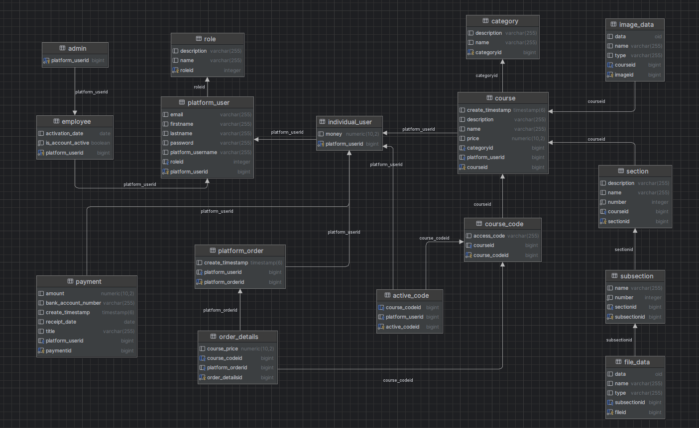

# Course-Web-App

### Aplikacja do tworzenia i kupowania kursów online.

## Technologie
* ### backend: Java, Spring Boot
* ### frontend: JavaScript, React
* ### baza danych: PostgreSQL

## Opis
Aplikacja pozwala na tworzenie, kupowanie oraz udzielanie dostępu do materiałów kursów. Daje możliwość w zależności od roli zarządzania kursem, zamówieniami, płatnościami oraz użytkownikami. 
Kupowanie opiera się na kodach kursu, których jest ograniczona ilość, oraz mogą być one generowane przez użytkownika z odpowiednią rolą. Każdy kurs ma swoje kody. Użytkownik może kupić wiele kodów danego kursu, jednak aby otrzymać dostęp do materiałów kursu musi aktywować go jednym kodem. Reszte kodów może przekazać innym użytkownikom, którzy mogą dany kurs aktywować.

## Role użytkowników w systemie z uprawnieniami

* ### Użytkownik niezalogowany:
  * Może stworzyć konto użytkownika indywidualnego lub zalogować się na istniejące konto dowolnej roli
  * Może zobaczyć dostępne kursy oraz ich szczegóły (bez dostępu do materiałów)
  * Może dodawać kody kursów do koszyka (z możliwością zakupu po zalogowaniu jako użytkownik indywidualny)

* ### Użytkownik indywidualny:
  * Może się wylogować 
  * Może zobaczyć dostępne kursy oraz ich szczegóły (bez dostępu do materiałów)
  * Może dodawać kody kursów do koszyka oraz jeżeli ma odpowiednią kwotę na koncie, to może je kupić (złożyć zamówienie), (zawsze może kupować kody, nawet jeśli kurs już został aktywowany na koncie)
  * Może aktywować nieaktywowany wcześniej kurs kodem (kupionym wcześniej, który jest w zamówieniach wśród kodów kupionych dla danego kursu lub otrzymanym od innego użytkownika)
  * Ma dostęp do materiałów kursu, który wcześniej aktywował (pliki pdf).
  * W panelu konta może zobaczyć:
    * listę stworzonych kursów
    * listę aktywowanych kursów
    * historię zamówień z podsumowaniem dla każdego zamówienia, jakie kursy są w zamówieniu oraz kupione kody dla każdego kursu, z informacją, które kody są już użyte (aktywne), a które nie są użyte (nie aktywne)
    * listę wpłat
    * dane konta

* ### Pracownik:
  * Może się wylogować
  * Może zobaczyć dostępne kursy oraz ich szczegóły (ma dostęp do materiałów)
  * Nie może kupować kodów kursów ani aktywować kursów
  * W panelu pracownika może:
    *  zobaczyć listę kursów, po przejściu w szczegóły dla danego kursu z tego panelu może wygenerować wybraną liczbę nowych kodów dla kursu
    *  zobaczyć listę wszystkich złożonych zamówień z podsumowaniem dla każdego zamówienia, jakie kursy są w zamówieniu oraz kupione kody dla każdego kursu, z informacją, które kody są już użyte (aktywne), a które nie są użyte (nie aktywne)
    *  zobaczyć listę wszystkich wpłat oraz usunąć wybrane wpłaty (zmniejsza to kwotę na koncie użytkownika, do którego była przpisana wpłata)
    *  dodać wpłatę dla danego użytkownika na podstawie jego adresu email oraz danych płatności
    *  zobaczyć dane konta
   
* ### Administrator:
  * Ma wszystkie takie same uprawnienia jak pracownik (ma dostęp do panelu pracownika)
  * W panelu administratora może:
    *  zobaczyć listę użytkowników indywidualnych oraz pracowników
    *  pracownikom zmieniać status na aktywny, co oznacza że pracownik może się zalogować, lub nieaktywny, co oznacza że pracownik nie może się zalogować na konto
    *  dodać nowego pracownika
    *  zobaczyć dane konta (dla administratora w panelu pracownika nie ma już danych konta)
   
* ### Super Administrator:
  * Ma wszystkie takie same uprawnienia jak administartor (ma dostęp do panelu pracownika oraz administratora)
  * W panelu administratora może dodatkowo:
    *  zobaczyć oprócz listy użytkowników indywidualnych oraz pracowników, także listę administratorów systemu
    *  tak jak pracownikom, zmieniać administratorom status na aktywny, co oznacza że administrator może się zalogować, lub nieaktywny, co oznacza że administrator nie może się zalogować na konto
    *  dodać nowego administratora
   
## Logowanie
Użytkownik indywidualny nie ma ograniczeń logowania. Pracownik oraz administrator mogą się zalogować na konto od daty aktywacji konta oraz jeżeli status konta jest aktywny.

## Schemat bazy danych

  
