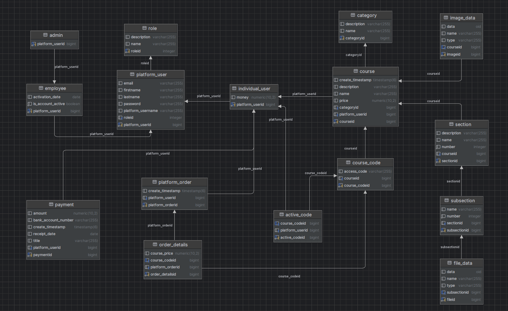
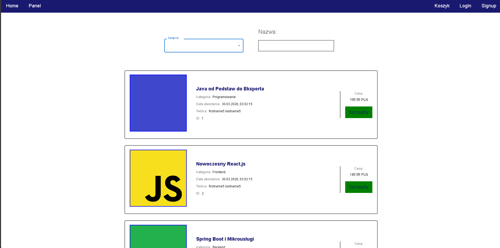
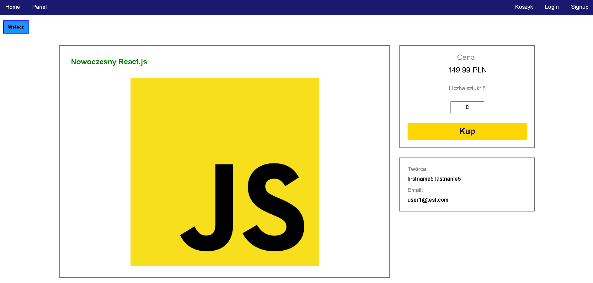
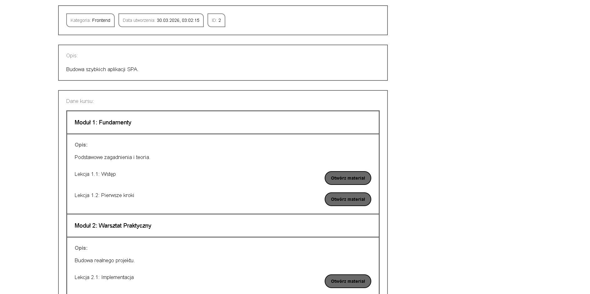

# Course-Web-App

### An application for creating and purchasing online courses.

## Technologies

* ### Backend: Java, Spring Boot
* ### Frontend: JavaScript, React
* ### Database: PostgreSQL
* ### Docker

## Running the application (Docker)

### Start:

```bash
docker-compose up --build
```

### Stop:

```bash
docker-compose down
```

### Link: http://localhost:3000

---

## Description

The application allows users to create, purchase, and access course materials. Depending on the user role, it provides management capabilities for courses, orders, payments, and users.

The purchasing system is based on course codes, which have a limited quantity and can be generated by users with appropriate roles. Each course has its own set of codes. A user can purchase multiple codes for a given course, but to gain access to the course materials, they must activate it using one code. The remaining codes can be shared with other users, who can then activate the course on their own accounts.

The application comes with **preloaded sample data**, allowing immediate testing and presentation after startup.

---

## User roles and permissions

* ### Unauthenticated User:

  * Can create an individual user account or log in to an existing account of any role
  * Can view available courses and their details (without access to materials)
  * Can add course codes to the cart (purchase possible after logging in as an individual user)

---

* ### Individual User:

  * Can log out
  * Can view available courses and their details (without access to materials)
  * Can add course codes to the cart and purchase them if they have sufficient balance (place orders)
  * Can always purchase codes, even if the course has already been activated
  * Can activate a course using a code (purchased earlier or received from another user)
  * Has access to course materials (PDF files) after activation
  * In the account panel can view:

    * List of created courses
    * List of activated courses
    * Order history with details (courses, purchased codes, used/unused status)
    * List of payments
    * Account details

---

* ### Employee:

  * Can log out
  * Can view available courses and their details (with access to materials)
  * Cannot purchase or activate course codes
  * In the employee panel can:

    * View the list of courses and generate new codes for a selected course
    * View all orders with detailed summaries
    * View all payments and delete selected ones (reduces user balance)
    * Add a payment for a user based on email and payment details
    * View account details

---

* ### Administrator:

  * Has all permissions of an Employee
  * In the admin panel can additionally:

    * View lists of individual users and employees
    * Activate/deactivate employee accounts
    * Add new employees
    * View account details (separate from employee panel)

---

* ### Super Administrator:

  * Has all permissions of an Administrator
  * Additionally can:

    * View administrators in addition to users and employees
    * Activate/deactivate administrator accounts
    * Add new administrators

---

## Authentication

Individual users can log in without restrictions. Employees and administrators can log in only after their account is activated and if their status is set to active.

---

## Database schema



---

## Test accounts

* ### Individual User:
  * email: user1@test.com
  * password: 123456

* ### Employee:
  * email: employee1@test.com
  * password: 123456

* ### Administrator:
  * email: admin2@test.com
  * password: 123456

* ### Super Administrator:
  * email: admin1@test.com
  * password: 123456

---

## Screens:

* ### Home view


* ### Courses list view



* ### Course details view






---